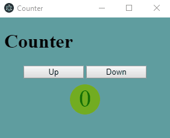

# Electron Test
Ein einfacher Test mit Visual Studio Code und electron in Typescript



## Initialisierung und Starten der app

Initialisieren der App (also laden der Abhängigkeiten ) über..
```
npm install
```


Starten der App über
```
npm start
```
## .exe erzeugen

```
electron-packager . counter --platform=win32 --arch=x86_64
```